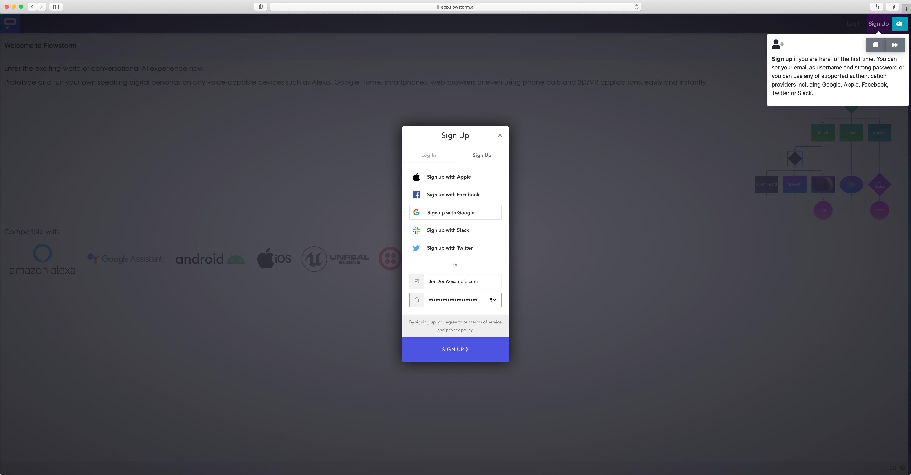

# How to Sign Up

1. Open [https://app.flowstorm.ai](https://app.flowstorm.ai)  
2. Clicking the [Sign Up](https://app.flowstorm.ai/#!/signup) in the top right corner to open a sign-up form  
3. Choose a preferred authentication providers \(Google, Apple, Facebook, Twitter or Slack\) or create an account using a traditional e-mail & password.

4. Check your e-mail and click the confirmation link to approve that you are the owner of the address.

5. After confirming the e-mail you can click "Back to Promethist.app" and [**log in to access**](https://app.flowstorm.ai/#!/login) the platform and start designing your first dialogue \(voice application\).

