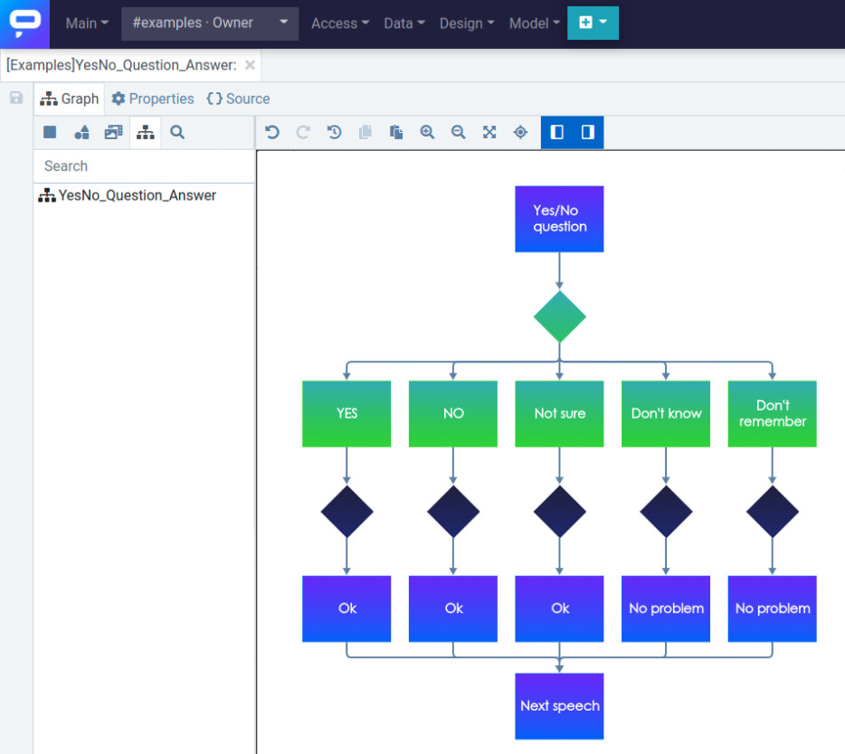
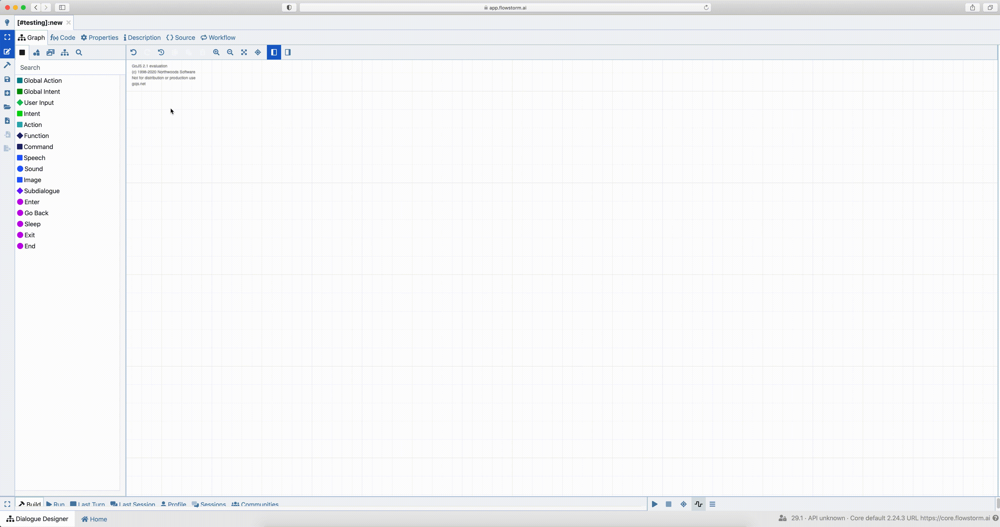

# Snippet Designer

When you want to create a robust applications you face the same situations again and again.

The snippet designer can help you. Prototype a node structure = snippet once and use it as many times as you need.

### How to create a snippet

* Open **Design** > **Snippet Designer**
* Create a structure or copy and paste a proven structure from existing dialogue
* Switch from Graph to **Properties** tab and give it a name (see example below)
* **Save** the snippet by the **save button** on the left

.png>)

### How to use existing snippet

Created snippets can be placed **into the graph** in Dialogue designer via **drag\&drop** feature from the snippet pallete when you are editing the dialogue.

