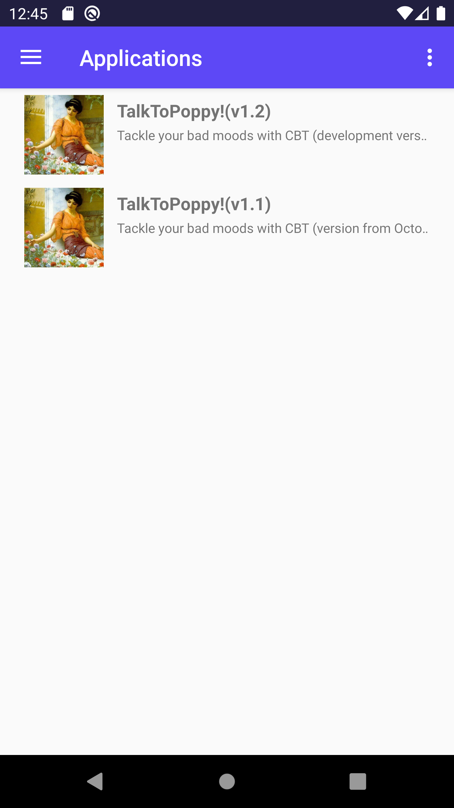
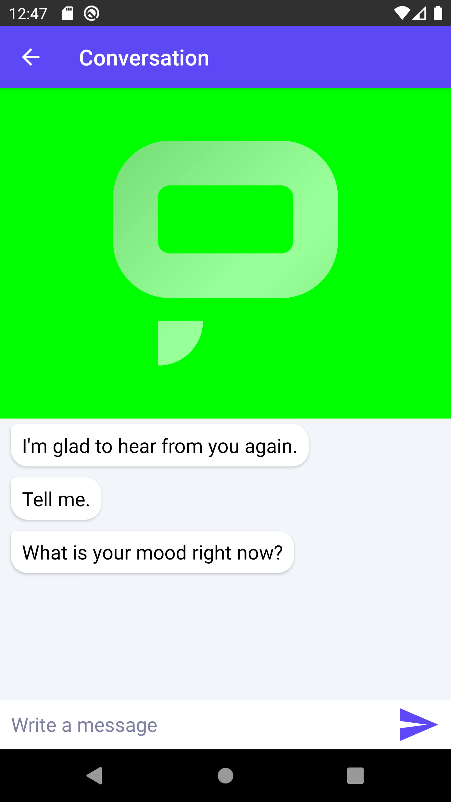
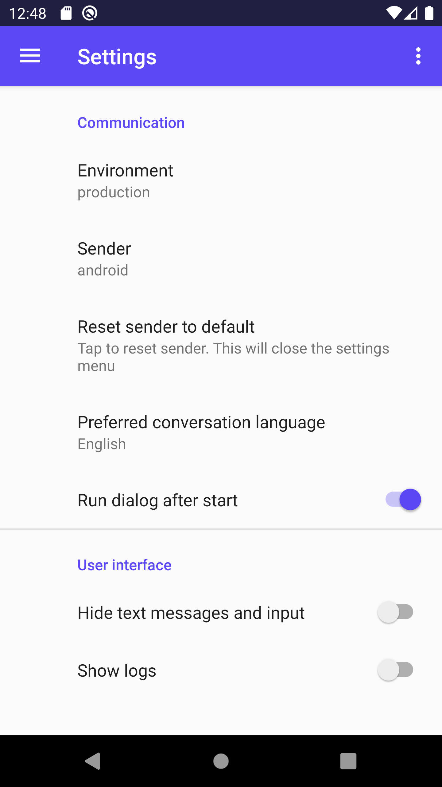

# Android Application

The Android app is available here: [https://play.google.com/store/apps/details?id=ai.promethist.android](https://play.google.com/store/apps/details?id=ai.promethist.android)

### Using the application

Initially, only public applications are available. If you are registered in the Promethist platform, you can **Log in** using the button in the menu in the upper right corner of the screen. After that, you will be able to use applications which were assigned to you.

#### Talking to the bot

If the conversation does not start immediately, check your connection and also the option "**Run dialog after start**" in the settings.

The rectangle with the Promethist logo indicates the state which the bot is currently in:

* Gray means that the bot is idle or responding
* Green means that the bot is open for your input. You can either speak or use the text input field. Both options are disabled if the bot is not listening
* Blue means that the bot either processes your input or that it is paused

When the bot is responding, you can skip the current response by tapping the area with Promethist logo or pause the response by long pressing it \(tap again to resume\). 

#### Settings

Access the settings in the left-hand panel which opens upon tapping the hamburger menu on the left.

* **Environment** - production, preview or develop
* **Sender** - device identification
* **Reset sender to default** - resets the sender field to device's unique 
* **Preferred conversation language** - deprecated, language is set on the server side
* **Run dialog after start** - if set to false, the dialogue will not start right after choosing an application, you need to start it by tapping the logo
* **Hide text messages and input** - Hides all messages from the conversation
* **Show logs** - Shows technical info in the conversation log

