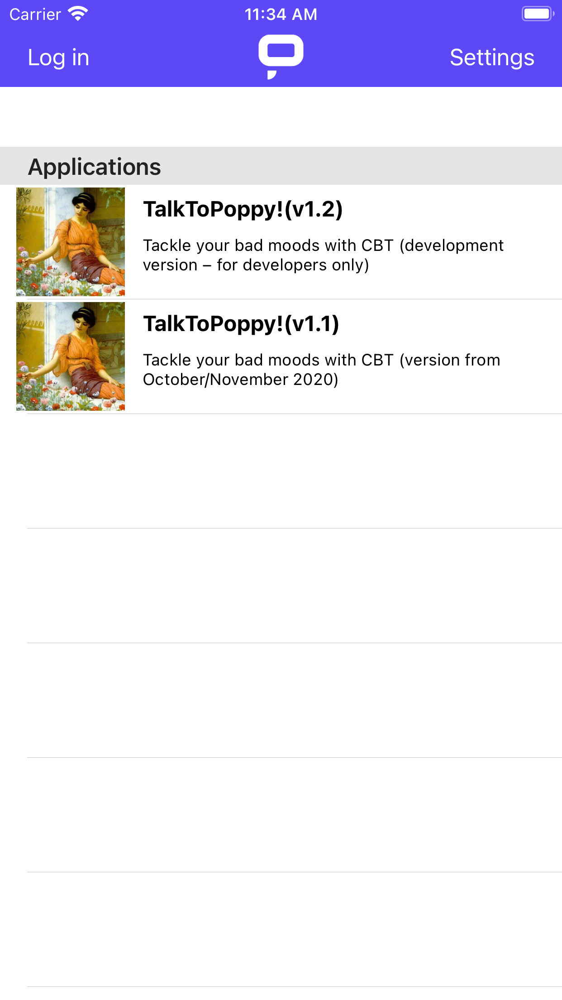
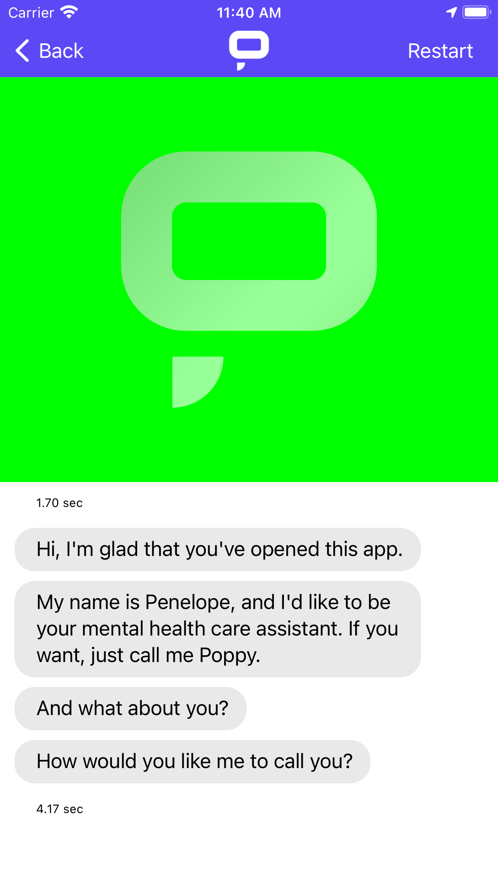

# iOS Application

The iOS application is available at [https://apps.apple.com/app/promethist/id1499825269](https://apps.apple.com/app/promethist/id1499825269) 

### Using the application

Initially, only public applications are available. If you are registered in the Promethist platform, you can **Log in** using the button in the upper left corner of the screen. After that, you will be able to use applications which were assigned to you.

#### Talking to the bot

The interaction with the bot is voice-only. The bot starts listening when the rectangle turns green. If the rectangle is blue, the bot is processing the input. The current response can be skipped by tapping the area with Promethist logo. Tap the **Restart** button to start the conversation from the beginning.

### Becoming a beta tester

To participate in testing the app and receive the latest \(though possibly unstable\) updates, please follow these steps:

1. Install the TestFlight application from the AppStore
2. Send your AppleID to the administrator
3. Wait for an e-mail with invitation to the Promethist TestFlight organization, then accept it.
4. Inform the administrator that you have accepted and they will activate the Promethist app for you and let you know
5. Open TestFlight. The Promethist app will be available. Install it using a button.
6. Test the Promethist app

The TestFlight will notify you everytime a new version is available.

