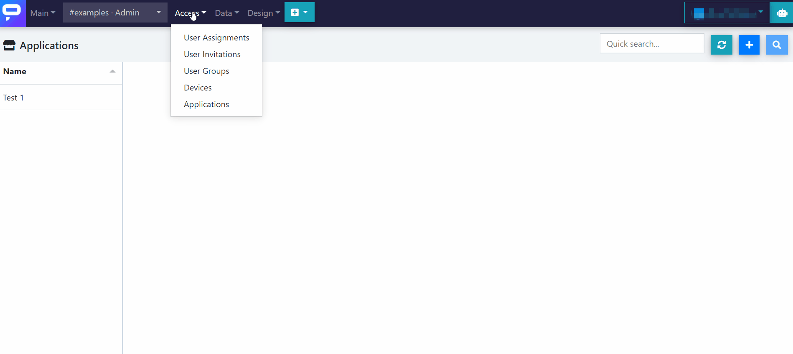

# Define It

To define a new application:

1. Go to **Access** &gt;&gt; **Applications**.
2. **Click on "+"** in the upper right corner of the screen.
3. Type in the **name** \(you can change it anytime\) and the **description**.
4. **Select the main dialogue**:
   1. Click on the **grey box "Main Dialogue"**.
   2. **Choose one of your dialogue models** from the list and click on Open.
5. If you want your app to be **public** \(visible in the Flowstorm mobile app\), tick the "Public" checkbox.
6. If you want your app to be **runnable by end-users who are not logged in** with a Flowstorm account, tick the "Anonymous Access Allowed" checkbox.
7. **Click on Save**. Your application will be created and it will be assigned an application ID.
8. If you now select the app from the list on the left, you will see that the Web Bot URL has been generated at _`https://bot.flowstorm.ai/$applicationID`_. You can also directly open the main dialogue by clicking on the blue-white arrowy button, which will open the model in the Dialogue Designer.

