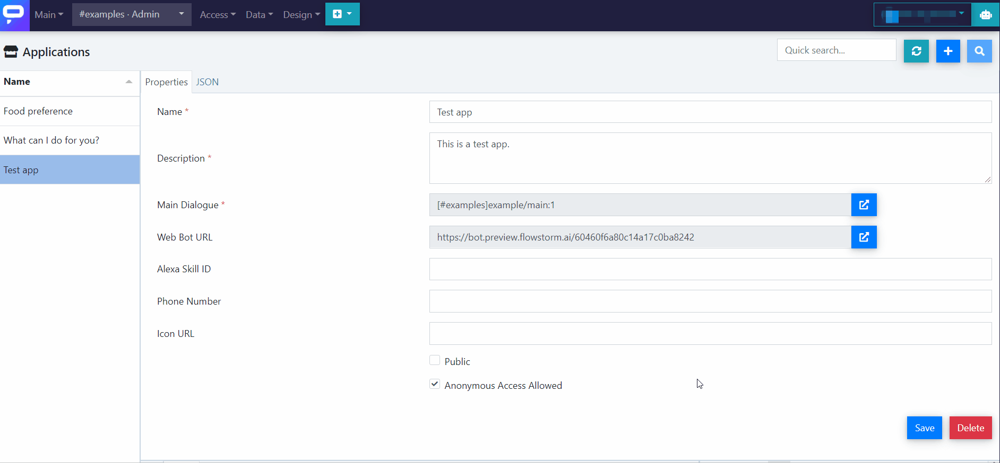

# Share It

You can share your app with end users through multiple channels. We are constantly trying to make it easier for developers to publish and share their apps, so the availability of the following options and their user-friendliness will often change. Stay tuned!


To communicate with the app via **voice**, it will be necessary, in most cases, to **enable the microphone** on the first run by clicking a pop-up notification. Keep in mind that ignoring it can lead to the app turning off or crashing.


## Web bot \(URL link\)

The easiest way to share your app is by sending your end users a URL link, which they can open in any browser.

* You will find the link in the "**Web Bot URL**" box. It is generated automatically, as explained in the [previous article](define-app.md). See the following gif.
* You can also open the web bot inside Flowstorm, if you click on the blue-white arrowy button next to the box \(see the gif\).

## Mobile apps

There are Flowstorm mobile applications for both [Android](https://play.google.com/store/apps/details?id=ai.promethist.android) and [iOS](https://apps.apple.com/us/app/promethist/id1499825269). You can access your conversational applications using one of these methods:

1. Assign the app to an account
   1. Open User Assignments in the web console.
   2. Click on the user you want to assign the application to.
   3. In the opened window, select your application in the Applications dropdown and click Save.
   4. Login to that account in the mobile app and you should see the app on the list.
2. Open a Flowstorm link **\(Coming soon\)**
   1. Click on the link from section [URL link](share-app.md#web-bot-url-link) on your mobile device while you have the app installed. An option to open the link should appear. Open the link with the app.
   2. The app will launch and also will be added to the "Recent" app list from where you can launch it again.

## Alexa skill

You can pair your Flowstorm app with an Alexa skill. See [this article](../../clients/alexa.md) for details.

## Phone call \(Twillio\)

It is possible to use a phone number to make and receive calls as your application. See [this article](../../core/client-integrations/twilio.md) for details.

