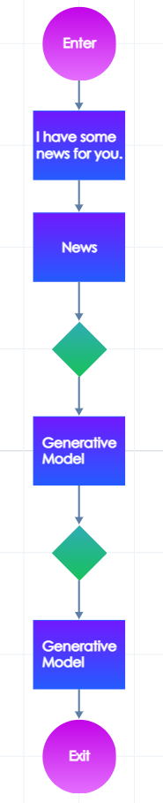
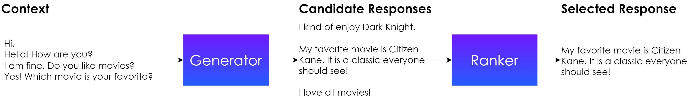

# +Use generative models


This article describes the use of **GPT-2**.

**If you want to use **<mark style="background-color:green;">**GPT-3**</mark>** or another generative model, please contact our technical support.**


## Why you need a generative model

The generative model, also known as Neural Response Generator (NRG), is helpful in all situations in which you don't want to write responses by hand. Imagine you want to create a chatty persona that can chat about anything without a particular goal. You can run the generative model in a loop to generate a response for each user's input.


Or you can use the generative model to handle out-of-domain examples. Imagine that you build a tree that asks users what emotion they feel. The expected responses can be emotions like "happiness", "sadness", "enjoyment", etc. However, no matter how hard you try, there will always be long tail, out-of-domain responses such as "I have no emotions" or "I feel like a kangaroo". And you can't prepare a reply for all possible user inputs. However, you can generate a response for out-of-domain inputs thanks to the generative model and give a satisfactory response to a larger number of inputs with less human labor required.


Or you can use the generative model to enhance the conversation. Imagine that your digital persona presents a news snippet. You can include the news snippet into the context and let the generative model handle the conversation for several turns. The generated responses should be related to the topic of the news snippet, no matter what it is.



The generative model can also be used in a hybrid way, which combines hand-designed dialogue trees and generated responses. For this purpose, you can influence the generated response by specifying a few words with which the response should start. Alternatively, some models support generation controllable by dialogue act specification where you can influence whether a response will be a statement, question or another supported dialogue act. This control option is essential in hybrid dialogues because the dialogue act of the generated response influences the structure of the dialogue flow. For example, if the generative model generates a question, you should give the user an opportunity to answer it by placing a user input node into the dialogue flow. If the generative model generates a statement, you can directly attach the following speech node.

 (1).png>)

Those were just a few possible applications of the generative model. To sum it up, the generative model is a versatile tool that increases the robustness and richness of the dialogue without the need for extensive human dialogue-designing labor.

## How the generative model works

The generative model consists of two components, the Generator and the Ranker. The Generator takes the context of the dialogue and generates candidate responses. The context is understood as a certain specifiable number of utterances preceding the node that includes the Generator component. The Ranker then ranks the candidate responses. The Ranker takes as input the last preceding utterance and the candidate responses and selects the one it considers the best fitting.



Flowstorm supports the following Generators:

| Generator                         | Description                                                                                                                                                               |
| --------------------------------- | ------------------------------------------------------------------------------------------------------------------------------------------------------------------------- |
| EmpatheticDialogues               | DialoGPT\_large model fine-tuned on [EmpatheticDialogues](https://github.com/facebookresearch/EmpatheticDialogues)                                                        |
| EmpatheticDialogues\_DialogueActs | DialoGPT\_large model fine-tuned on [EmpatheticDialogues](https://github.com/facebookresearch/EmpatheticDialogues) with output controllable by dialogue act specification |
| TheTherapyFanfic                  | DialoGPT\_small model fine-tuned on fictional transcripts of therapy sessions                                                                                             |
| CCPE\_Movies                      | DialoGPT\_small model fine-tuned on movie-related dialogues                                                                                                               |

Flowstorm supports the following Rankers:

| Ranker | Description                                                                                                                                          |
| ------ | ---------------------------------------------------------------------------------------------------------------------------------------------------- |
| updown | DialogRPT-updown model by [HuggingFace ](https://huggingface.co/microsoft/DialogRPT-updown)trained on the up/down votes a comment receives on Reddit |

## Using the generative model

The functions to invoke the generative model are:

```
nrg.generate(generatorModel: GeneratorModel, 
        rankerModel: RankerModel, 
        contextLength: Int = 3, 
        responseStart: String? = null, 
        dialogueAct: DialogueAct? = null,
        generatorParameters: MutableMap<String, Any>? = null): String?

nrg.generate(generatorModel: GeneratorModel, 
        rankerModel: RankerModel, 
        generatorContext: List<String>, 
        responseStart: String? = null, 
        dialogueAct: DialogueAct? = null,
        generatorParameters: MutableMap<String, Any>? = null): String?
```

The most straightforward way to generate a response by the generative model is to write the following into a speech node:

```
${nrg.generate(GeneratorModel.EmpatheticDialogues, RankerModel.updown)?:"No response"}
```

The first parameter specifies the generator, and the second specifies the ranker we want to use. If there is an error during the generation process, _"No response"_ is the fallback.

### Context length

You can also specify an optional parameter `contextLength` that specifies how many previous utterances will be used as context for the generator (`contextLength: Int = 3`). The following example demonstrates how context length is computed:

| contextLength                | Utterance                                                                          |
| ---------------------------- | ---------------------------------------------------------------------------------- |
| 7 (but we filter out #intro) | **User:** #intro                                                                   |
| 6                            | **Digital Persona:** Hello, how can I help you?                                    |
| 5                            | **User:** Let's track my emotions.                                                 |
| 4                            | **Digital Persona:** OK. I see. What is your emotion right now?                    |
| 3 (default value)            | **User:** I feel happy                                                             |
| 2                            | **Digital Persona:** Happy? That's great. What is the intensity of your happiness? |
| 1                            | **User:** It is pretty deep                                                        |
|                              | **Digital Persona:** _Response generated by Generative model_                      |

A longer context should lead to a more coherent generated response as the model has access to more information about the history of the dialogue. However, it also leads to a longer time of generation and thus longer latency. The length of `3` (previous utterances) is a reasonable value.

```
${nrg.generate(GeneratorModel.EmpatheticDialogues, RankerModel.updown, 3)?:"No response"}
```


You can mask a longer computational time by inserting a filler speech node containing _"Well."_ or _"You know."_ between the user input node and speech in which you generate a response. Such nodes contained in the last unfinished turn are not included in the context.


### Generator context

The context for generation is constructed automatically from previous turns. You can also provide custom context by passing `generatorContext`:

```
${nrg.generate(GeneratorModel.EmpatheticDialogues, RankerModel.updown, listOf("Hello!", "Hi! How are you?"))?:"No response"}
```

### Response start

You can also influence how the generated response will start by passing text into the `responseStart` parameter. The model will start with the text in the parameter, and generate the rest of the response. Thus, if you would like the generated response to start with _"I think",_ use the following:

```kotlin
${nrg.generate(GeneratorModel.EmpatheticDialogues, RankerModel.updown, responseStart = "I think")?:"No response"}
```

### Dialogue Act

You can control the dialogue act of the generated response by the parameter `dialogueAct`. Only some models support this feature as the model has to be trained by a different training procedure to support this way of control. We appended `_DialogueActs` to the names of models that support this feature. The currently supported dialogue acts are:

```
open_question
yes_no_question
command
opinion
statement
yes_answer
no_answer
other_answer
```

To use this feature, use the following:

```
${nrg.generate(GeneratorModel.EmpatheticDialogues, RankerModel.updown, dialogueAct = DialogueAct.statement)?:"No response"}
```

The generator will output a response in the form of a statement.


It might be challenging for a generative model to generate a selected dialogue act due to the nature of the conversation in some cases. Thus, the model can sometimes generate a different dialogue act than specified. To illustrate this with an example, imagine the user asking a yes-no question at a moment when we also want to generate a yes-no question. Two yes-no questions in succession rarely happen in real-world conversations. Thus, the model can have difficulty generating a yes-no question that fits the context. It might happen that the generative model either generates a response with a different dialogue act or the specified dialogue act will be correct but it will not fit the context entirely.


### Generator parameters

You can also influence the parameters of the Generator by passing generatorParameters. However, the default parameters should be sufficient in most cases. The default parameters used in Flowstorm are:

```
val defaultGeneratorParameters = mutableMapOf<String, Any>(
                "num_return_sequences" to 5, // how many sequences generator generates (have to be smaller or equal to "num_beams")
                "num_beams" to 10, // how many beams to use to find the most probable sentences
                "do_sample" to false, // false - use beam search (find the n most probable sentences); true - use sampling (select each word independently according to its probability); 
                "min_length" to 20, // minimal length of response in BPE tokens (“the”, “small”, “est”, “tower”, “in”, “Prague”) 
                "max_length" to 50, // maximal length of response in BPE tokens
                "repetition_penalty" to 1.5, // number between 1 and infiny (however 2 is reasonable upper bound). The larger value will force model to not repeat words in generated sequence.
                "length_penalty" to 2, // value between 0 and infinity. Set to values < 1.0 in order to encourage the model to generate shorter sequences, to a value > 1.0 in order to encourage the model to produce longer sequences.
                "num_beam_groups" to 5, // how many diverse groups of responses will beamsearch try to find
                "diversity_penalty" to 1.0, // value between 0 and 1, how the generator will trade between divestity and quality of response. 1 means that the model will completely prefer deiversity over quality.
                "no_repeat_ngram_size" to 3 // don't generate sentences, in which any triple of words appears more than once ("I like you because I like you"). Use 2 for touple of words, 4 for 4-grams...
                )
```

The parameters are listed in the [documentation of HuggingFace](https://huggingface.co/transformers/main\_classes/model.html?highlight=generate#transformers.generation\_utils.GenerationMixin.generate) and explained in the blog post [How to generate text: using different decoding methods for language generation with Transformer](https://huggingface.co/blog/how-to-generate).


If you use custom parameters and you don't define any, the default values from [HuggingFace](https://huggingface.co/docs/transformers/main\_classes/model?highlight=generate#transformers.generation\_utils.GenerationMixin.generate) will be used for the ones you didn't define.

