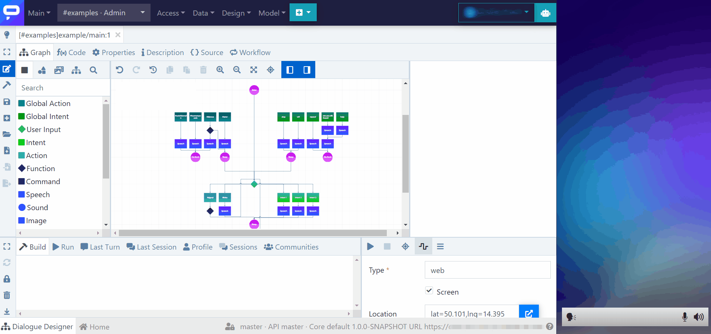
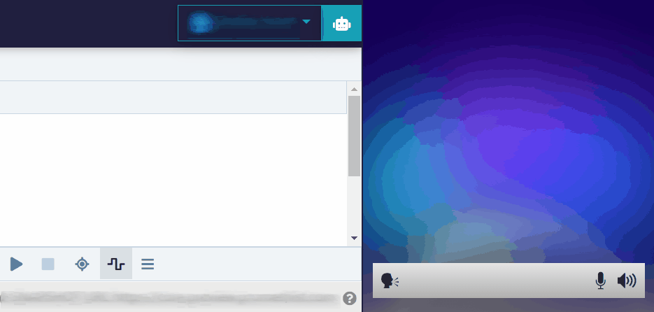

# Build and Test Dialogues

When you are editing a model, you can continuously save your changes, but it's not until you successfully **BUILD** the model that the resulting conversation will be updated. Once the model is built, you can also immediately **RUN** it in the Dialogue Designer, to test if everything works the way you planned.

## Build the model

To build a model, just click the Build button – the cute little hammer.

.png>)


_Build_ always **saves automatically the current state** of the model, so you don't need to extra-click on _Save_.



If you know that you will want to **run the model immediately after the build, just click on Run** – if the model has been changed since the last build, Run will automatically trigger a new build and then immediately start the conversation.


### Build failed

When the build fails, it means that there is something wrong with your dialogue model. What to do?

1. Inspect thoroughly the **Build log**, which shows the problems that the system has encountered.
2. If that doesn't help, check if your problem is covered in our [**FAQ**](broken-reference).
3. If you still have no idea what's gone wrong, refer to our **support**.

## Run the model

To run a model to test it inside the Dialogue Designer, you have two basic options:

### **Without initial input (the bot will start)**

You can just initiate the interaction without any input and let the bot start.

* To do this, just click the Run button ("play").
* In this case, `#intro` is sent – meaning "the user has initiated the interaction".

### With initial input (the user starts)

You can also initiate the interaction by directly asking something.

* To do this, just input your message via the bot panel.
* In this case, the bot can react to your message right away.
* _Note: this scenario only works if there is a User Input node right after the Enter node, and it will typically be used only in the main dialogue of an application._


_Run_ always runs the current state of the model: if there have been changes to the model since the last build, **Run will first save these changes and re-build the model**, then it will automatically start the interaction.

