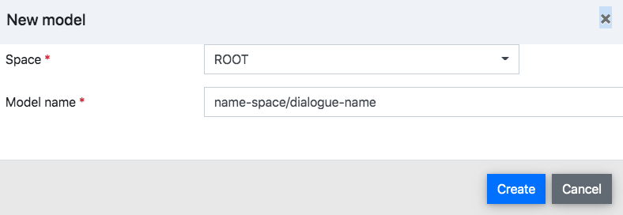

# Create It

The dialogue model represents the dialogue flow in the form of a graphical structure of interconnected nodes. 

### Create dialogue model

1. **Go to** _**Design &gt;&gt; Dialogue Designer**_ or just use the [keyboard shortcut](https://docs.promethist.ai/app/keyboard-shortcuts) **d** to open the [Dialogue Designer](https://docs.promethist.ai/app/working-space/design/dialogue-designer).
2. **Click on** _**Model &gt;&gt; New**_**…** or just use the keyboard shortcut **n** to create a new dialogue model.
3. **Choose** **the** _**Space**_ you want to save your dialogue model in.
4. **Pick** **a** _**Model name**_ for your dialogue model in the form _project-name/model-name_.
5. **Click on** _**Create**_. Your dialogue model is created and you can start [designing](https://docs.promethist.ai/how-to/design/design-dialogue) it.

