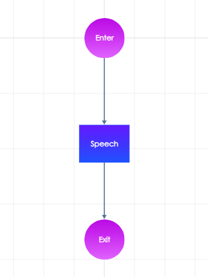

# Design it

After creating the dialogue model, you will se the main editing area with a simple structure of built-in nodes. These are necessary for even the simplest dialogue and without them, you won't be able to build it.

### Enter the dialogue

In order to start the dialogue, you need to use the \(pink\) **Enter** node. You can't edit it's content, his functionality is written in the programming code you can't see in the dialogue designer.  

### Make your chatbot speak

The \(blue\) **Speech** node is one of the most important nodes in your dialogue. Here you can specify what your chatbot will say to the user. Click on the node and write the chatbot speech in the **Texts** field in the right panel \(the red circle in the screenshot below\).

### Exit the dialogue

Just as the **Enter** node, the **Exit** node is necessary to make the dialogue work. At the end of every dialogue, there must be an Exit node whose functionality is not editable in the dialogue designer.

So you have just created the simplest functional dialogue possible but another very important part of the conversation is missing – the user.

### Create a conversation

In order to include the user speech in the conversation, use two following nodes: \(green\) **User Input** node and **Intent** node. 

1. In the left panel **select the "Nodes" tab** \(the red circle in the screenshot below\).
2. Make sure the chatbot will listen while the user is speaking by using the User Input node – **drag and drop it into the graph**.
3. Repeat the same process with the Intent node.
4. Link it to other nodes in the graph by using the **transition** line – hover above the Speech node inside graph and choose one of ports to connect node to another one by dragging **transition**

