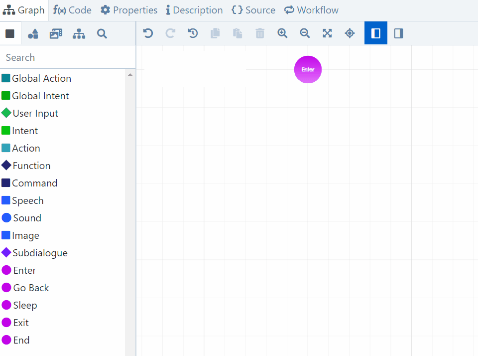

# Insert a Group of Nodes

Nobody wants to spend their time designing the same structure again and again node by node. That's why Flowstorm offers you a simple tool to speed up your designing process: introducing **dialogue snippets** - reusable node structures which will boost your productivity!

* Design faster, be more productive.
* Reduce repetitive work.
* Make your dialogues more robust by using built-in dialogue snippets.
* Create custom snippets that suit your needs.

## Insert a predefined structure

To insert an existing dialogue snippet:

1. Click on the **"snippets" tab**.
2. Select a snippet from the list and **drag and drop** it onto the canvas.
3. Add, remove, modify or connect the inserted nodes just like any other.


It's important to emphasize that snippets are templates - once you insert a snippet, you can modify anything without modifying the source.

If you _do_ want to modify the source snippet - or create a new one, use the [Snippet Designer](../../../app/space/design/snippet-designer.md). Also, see this page below.


### "Application main" dialogue snippet

Probably the most important structure is the "application main" snippet. It is intended for the main dialogue of an application (where the app starts) – it covers all the necessary actions and global intents and it is fully functional. It includes default reactions and 3 placeholder local intents.

.png>)

## Design your own reusable structure

The default Flowstorm snippets will not always be enough. To create your own dialogue snippet:

1. Open the [**Snippet Designer**](../../../app/space/design/snippet-designer.md)** **(_Design_ >> _Snippet Designer_).
2. **Design your snippet model.** To set its name, visit the tab _Properties_.
3. **Save **your snippet.
4. From now on, you will see it in the snippet list - you can start using it immediately.


Similar to other objects (dialogue models, file assets...), snippets are created "per Space", so they will be shared with all your Space collaborators.


### Modify a snippet

If you need to modify an existing snippet:

1. Open the [**Snippet Designer**](../../../app/space/design/snippet-designer.md) (_Design_ >> _Snippet Designer_).
2. **Open **an existing **snippet model** (_Model_ >> _Open_).
3. **Modify** it according to your needs.
4. **Save** the changes.
