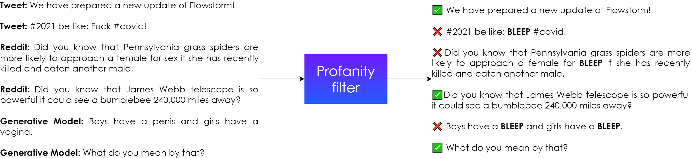

# \*Profanity Filter

## Why do you need a Profanity filter?

Imagine that you build a digital persona that has two sources of knowledge. It can either access knowledge in the form of text from external resources like Reddit or Twitter, or it uses a generative model. Both those scenarios have a common feature: you don't have complete control over what the persona will say. There are new tweets every day and the generative model can react with unexpected responses. Thus, checking the appropriateness is necessary.

Also, some users use foul language when talking to digital personas. If you want your digital persona to identify it and react appropriately, the Profanity filter can detect those instances. We provide you with the Profanity filter for both kinds of situations.

In summary, the Profanity filter is a component that searches for and filters out profane words in texts. The text is typically the input message of the user or a response of the digital persona over which the dialogue designer doesn't have full control.



## How does Profanity filter work?

The Profanity filter searches for words from a list of profanities using regular expressions.&#x20;


You can see the list of profanities here [⚠ sensitive content](https://core.flowstorm.ai/file/assets/spaces/61e589c079e5143f41f6a083).


For example, it finds that the replica "_Boys have a **penis** and girls have a **vagina**._" from the movie Kindergarten Cop contains profanities and it can bleep out those words. Thus, the output to the user will be _"Boys have a **BLEEP** and girls have a **BLEEP**."_ The search for profane words is case-insensitive, meaning that the Profanity filter considers words vagina, Vagina and VAGINA all the same.

However, the abilities of the Profanity filter based on the list of profane words are limited. It doesn't consider the context of the text or recognize more advanced profanities that work on the pragmatic level. Thus, the previous example from Kindergarten Cop can be considered OK in some contexts, but the Profanity filter filters it out anyway. Even though the words "penis" and "vagina" are not profane as such, they are included on the profanity list because their usage is problematic and the situations in which they might occur are sensitive. The efficiency of the Profanity filter depends on which words are considered profane and included on the list. On the other hand, some rude texts can pass the filter if they don't contain profane words. Keep those limitations in mind.


Rude texts can pass the filter if they don't contain profane words!


## Using Profanity filter

The Profanity filter can be used in two places - to detect when users use profanity words in their input and to filter out profanities that the digital persona might use in the responses.

### Profanities in user input

The Profanity filter checks all user input automatically. If it detects any profane words, it saves the corresponding information into a Boolean variable `input.isProfane`. An example of how to use it in the input node follows:

```
processPipeline() //run pipeline
if (input.isProfane){
    toProfanityHandling
} else {
    pass //proceed acording to intent
}
```

 (1) (1).png>)

### Profanities in responses

You can use two functions to handle profanities in responses - `isProfane` and `bleepProfanities`.

#### isProfane function

```
profanityFilter.isProfane(text: String): Boolean
```

The `profanityFilter.isProfane(text: String): Boolean` function takes a text as input and returns True if the text contains any word from the list of profanities and False if it doesn't contain any. This function is useful if you want to check that a text doesn't contain any profanities or if you have several alternative texts and you want to filter out those containing profanities.


The generative model uses the `isProfane` function to automatically filter the alternatives it generates.


The following code is an example of a function that checks if a tweet contains profanities. If it does, it continues to a speech node that doesn't include the tweet. If it doesn't contain a profane word, it continues to the speech node that does include the tweet.

```
// You probably get this tweet from a large database of tweets automatically
val tweet = "We have prepared a new update of Flowstorm! The new version includes many changes that will make working in Flowstorm a lot easier."

if (profanityFilter.isProfane(tweet)){
    toSay
}else{
    toDoNotSay
}
```

 (1).png>)

The two following codes show an example in which you want to read one of the Reddit fun facts randomly, but it needs to be one not containing any profanity. The first code is from the init code:

```
// List of fun facts you get from a large database
val funfacts = listOf("Did you know that Pennsylvania grass spiders are more likely to approach a female for sex if she has recently killed and eaten another male.", "Did you know that James Webb telescope is so powerful it could see a bumblebee 240,000 miles away?")
```

 (1) (1).png>)

The second code is from the content of the speech node:

```
${funfacts.filter{!profanityFilter.isProfane(it)}.random()}
```

 (1).png>)

#### bleepProfanities function

```
profanityFilter.bleepProfanities(text: String): String
```

The `profanityFilter.bleepProfanities(text: String): String` function takes a text as input and returns a text in which all profanity words are replaced with the word BLEEP. This function is helpful if you want to read a fun fact containing profane words but you don't want your digital persona to say them.

```
${profanityFilter.bleepProfanities("Boys have a penis and girls have a vagina.")}
```

 (1) (1).png>)


