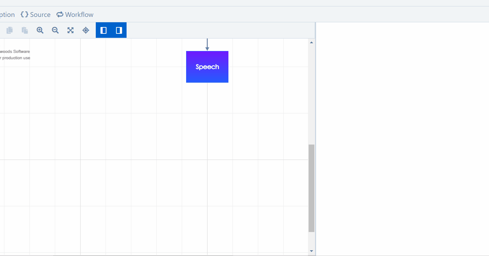

# Interconnect Dialogue Models

Why is designing multiple smaller dialogue models better than one large model? Interconnecting models ensures:

* a **better orientation** in the whole structure \(a group of nodes will be represented by a single node\);
* the independence of the models: multiple [conversation designers](../collaborate.md) can **collaborate simultaneously**, each one working on a different model.

## Link a dialogue to another dialogue

1. **Insert a** _**Subdialogue**_ node and connect it to the corresponding point of the flow.
2. In the right panel, **click on the grey box** \("Dialogue"\).
3. **Choose the dialogue model** that you want to connect to the original model.

   \(To open the selected model in a new tab, click on the blue-white arrowy button.\)

4. Continue the flow by connecting a follow-up node.

## **Hierarchical structure**

When the flow goes into a _Subdialogue_ node, the connected model \(the "subdialogue"\) becomes immersed inside the original model, which, in turn, becomes superordinate to the subdialogue. This way, you are creating an unrestricted hierarchical structure, with as many levels of immersion as you need; any dialogue model can be connected at any level, any number of times.

### Inherited global intents

The bot will always remember all the superordinate models through which the flow has immersed. Why is this important? Because **global intents of a dialogue model are always inherited by all models immersed in it** \(at all levels\).

Although it might seem confusing, it's actually **great news**: you don't need to define general global intents everywhere; a "repeat" global intent would typically be defined only at the highest level \(your main dialogue\), and all of the immersed models will inherit it.


When the user message is being processed, the available intents are analyzed in this order:  
1. _local intents_ \(in the User Input\), 2. _global intents_ \(in the model\), 3. _inherited global intents_ \(from superordinate models, level by level\). So **if you want to override an inherited global intent**, **just define the same intent in the immersed model** and this new one will be prioritized!


#### Example

In the following illustration, the _**main dialogue**_ model has 3 global intents labeled _stop_, _repeat_, and _play quiz_. There are two subdialogues inside it: _**Movie Quiz**_ and _**Small Talk**_. In this scenario, they will both inherit the 3 global intents from the main dialogue, and _**Movie Quiz**_ will have 2 more global intents of its own. Inside _**Movie Quiz**_, the flow can still immerse into the _**Are You Sure**_ model, which would inherit all 2+3 global intents from the two superordinate models. But the designer decided to override the inherited _repeat_, so they created a new one, which would be prioritized over the inherited one.


The same dialogue model can be immersed into different other models \(e.g. if you want to include the same Movie Quiz into more voice apps\), and these often have different global intents. This is why **the inherited intents are always inferred from the particular path which led to the current model** - it's the flow that determines them.


