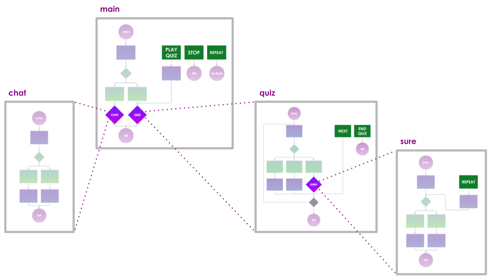

# Interconnect dialogues

Why is designing multiple smaller dialogues better than one large dialogue? Interconnecting dialogues ensures:

* a **better orientation** in the whole structure (a group of nodes will be represented by a single node);
* the independence of the dialogues: multiple conversation designers can **collaborate simultaneously**, each one working on a different dialogue.

## Link a dialogue to another dialogue

1. **Insert a **_**Subdialogue**_ node and connect it to the corresponding point of the flow.
2. In the right panel, **click on the grey box** ("Dialogue").
3.  **Choose the dialogue** that you want to connect to the original dialogue.

    (To open the selected dialogue in a new tab, click on the blue-white arrowy button.)
4. Continue the flow by connecting a follow-up node.

## **Hierarchical structure**

When the flow goes into a _Subdialogue_ node, the connected dialogue (the "subdialogue") becomes immersed inside the original dialogue, which, in turn, becomes superordinate to the subdialogue. This way, you are creating an unrestricted hierarchical structure, with as many levels of immersion as you need; any dialogue can be connected at any level, any number of times.

### Inherited global intents

The persona will always remember all the superordinate dialogues through which the flow has immersed. Why is this important? Because the **global intents of a dialogue are always inherited by all dialogues immersed in it** (at all levels).

Although it might seem confusing, it's actually **great news**: you don't need to define general global intents everywhere; a "repeat" global intent would typically be defined only at the highest level (your main dialogue), and all of the immersed dialogues will inherit it.


When the user message is being processed, the available intents are analyzed in this order:

1. _local intents_ (in the User Input)
2. _global intents_ (in the dialogue)
3. _inherited global intents_ (from superordinate dialogues, level by level)

So **if you want to override an inherited global intent**, **just define the same intent in the immersed dialogue** and this new one will be prioritized!


#### Example

In the following illustration, the _**main**_ dialogue has 3 global intents labeled _stop_, _repeat_, and _play quiz_. There are two subdialogues inside it: _**quiz**_ and _**chat**_. In this scenario, they will both inherit the 3 global intents from _**main**_, and _**quiz**_ will have 2 more global intents of its own (_next_, _end quiz_). Inside _**quiz**_, the flow can still immerse into the _**sure**_ dialogue, which would inherit all 2+3 global intents from the two superordinate dialogues. The creator decided to override the inherited _repeat_, so they designed a new one, which would be prioritized over the inherited one.


The same dialogue can be immersed into different other dialogues (e.g. if you want to include the same Movie Quiz into more voice apps), and these often have different global intents. This is why **the inherited intents are always inferred from the particular path which led to the current dialogue –** it's the flow that determines them.


## Share the same init code across dialogues

* Create an "**init mixin**". Go to _**Design >> Mixins**_, click on "+", select the type "init", fill in the rest of the details, and in the "Text" box, write the init code you want to reuse across multiple dialogues (e.g. declare variables).

.png>)

* Then open the dialogues where you want to link the init mixin, and in each of them, link it by selecting it in the _**Properties** tab **>> Mixins**_.

 (1).png>)
