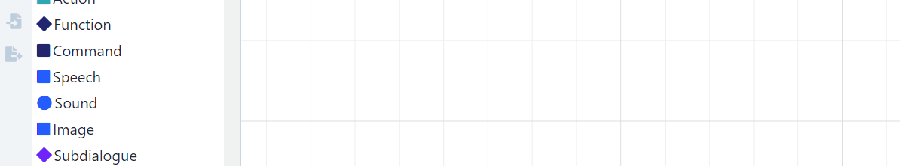
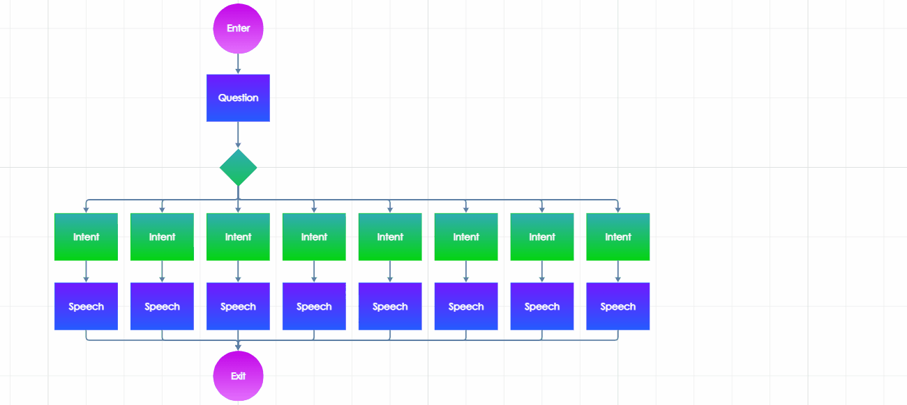

# Introduction

## The graph representation

A [dialogue model](create-dialogue.md) can be represented as a **graph structure**, which can be viewed and edited in the [Dialogues editor](../../studio/main-menu/design/dialogue-designer.md). The structure consists of different types of **nodes**, which represent the stuff that happens during a conversation, such as speaking, listening, or decision-making. Nodes are interconnected by small arrows or "**transitions**", which define the possible paths of a dialogue. Such a visual structure will help you understand clearly the flow of the dialogue.


Before we continue, it must be mentioned that **dialogue models can be interconnected** (a model can be nested in another model) and create complex conversational structures. We will talk about this in [another article](dialogue-linking.md). Here, we will describe the designing process within **one dialogue model**.


## Work in the Dialogues editor – basics

### Drag and drop & connect nodes

To insert an item (usually a node) into the structure, just drag it from the left panel and drop it into the canvas. You can then connect the nodes using transitions.

* The connection point **on the top** of a node is always the **entrance to the node**.
  * All node types have exactly one entrance point, except for _Enter_, which begins the flow.
* The connection point **at the bottom** of a node serves as the **way out of the node**.
  * Most node types have just one way-out point at the bottom.
  * _Functions_ and _UserInputs_, which can serve as forks, have two more way-out points **on the sides**. All 3 points are equal, they can just help you design a more comprehensible structure.
  * _Exit_, _End_, and _GoBack_ interrupt the flow, so they don't have any way-out points.

Most often, you will design the flow "falling down" through the graph – but that's definitely not a necessary rule! **Your flow can move in any direction** (see the illustration). Just keep in mind that the connection points on the nodes always work as described above.

.png>)

### Move, remove, copy & paste nodes

To **MOVE** a node, just drag it along the canvas.\
To **REMOVE** a node, click on it and then press Delete or Backspace on your keyboard.\
To **COPY** a node, select it and press Ctrl+C or click the Copy button.\
To **PASTE** from the clipboard, press Ctrl+V or click the Paste button.

To **select more than one node** and move/remove/copy all of them together, you can:

* either **select a part of the canvas**: click in the graph and wait for half a second, then drag your cursor elsewhere -> the canvas in between will be framed in pink and after releasing the cursor, all nodes inside that area will become selected;
* or **hold Ctrl and select nodes by clicking on one after another**.

Once a group of nodes is selected, you can perform the desired action on all of them.

