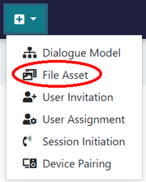

# Add Sounds and Images

Conveniently, each sound or image has its own node, so it can easily become part of the graph structure. A simple example of what it can look like:

## Upload files to your Space

1. **Go to** _**Design**_ **&gt;&gt;** _**File Assets**_**.** If you have already uploaded some multimedia files to your Space, you will see their complete list in the left panel.
2. **Click on "+" in the upper right corner** \(the red circle in the screenshot below\) to create a new empty item.
3. **Click on** _**Browse**_ **and select your file, then fill in the** _**Name**_ **field** \(what the file should be called in your Space\). If you want, you can also add a description.
4. **Click on** _**Save**_. Check if the file has been added to the list in the left panel. If not, try refreshing the list by clicking on the Refresh button next to the "+" button.
5. Now you can insert your file into any dialogue in your Space!


You can create a new file asset even more quickly through _Create_ \(the big **+** on the main menu panel\) &gt;&gt; _File Asset_. See the following screenshot. A simplified pop-up window will appear.


## Insert a file into a dialogue

1. When editing a dialogue, **select the "Multimedia" tab** \(the red circle in the screenshot below\).
2. Choose one of the files from the list and **drag and drop it into the graph**.
3. **Link it to other nodes** in the graph at your pleasure. The file will be played/displayed at the corresponding moment of the dialogue flow.


The list of multimedia files contains both sounds and images. The process is the same for both file types.



If you cannot see a newly uploaded file in the Multimedia tab, try refreshing the list by switching to another tab and back. If this doesn't work, try refreshing the whole page. If you still cannot see the file, check the list in _Design_ &gt;&gt; _File Assets_, and if needed, re-upload the file. 


