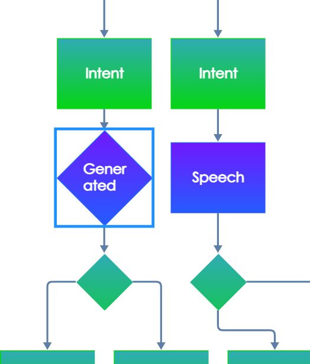

# Generated Speech Node

The Generated Speech Node is a fundamental component of the drag-n-drop editor for digital personas operated by Conversational AI. This node allows you to generate speech or text within a dialogue. It's a powerful tool for crafting dynamic and engaging conversations. In this documentation, we'll explore the various aspects of the Generated Speech Node, including its configuration options.

<figure><figcaption>
Generated speech node
</figcaption></figure>

The Generated Speech Node is designed to generate text or speech based on the provided input prompt. It leverages advanced language models, such as ChatGPT and GPT-4, to generate responses that can be used in your conversational applications. Underneath, it uses [llm.chat function](chat.md).

#### Prompt Panel

The "Prompt" configuration panel is where you define the input that guides the node's response generation. You can write a detailed prompt describing what the node should generate in the dialogue. The quality and relevance of your prompt will greatly influence the generated output.

<figure><figcaption>
Prompt panel
</figcaption></figure>

#### Config Panel

The "Config" panel contains several important settings that allow you to fine-tune the behavior of the Generated Speech Node. Here are the key configuration options:

1. **Model Selection Dropdown**
   * Choose between different language models for text generation. Options typically include "ChatGPT" and "GPT-4." Select the model that best suits your specific use case.
2. **Temperature**
   * Adjust the "temperature" parameter to control the randomness of the generated text. Higher values (e.g., 0.8) result in more randomness, while lower values (e.g., 0.2) make the output more deterministic.
3. **Max Tokens**
   * Set a limit on the maximum number of tokens (words or characters) in the generated output. This helps you control the length of responses.
4. **Top P**
   * Control the diversity of the generated output by specifying a threshold for the cumulative probability of the most likely tokens. A higher value, such as 0.9, allows for more diversity, while a lower value, like 0.2, results in more focused responses.
5. **Frequency Penalty**
   * Adjust the frequency penalty to discourage the model from repeating the same phrases or words too often. This helps in producing varied and natural-sounding responses. A higher frequency penalty value will result in the model being more conservative in its use of repeated tokens.
6.  **Presence Penalty**

    * Set the presence penalty to encourage the model to include a diverse range of tokens in the generated text. A higher presence penalty value will result in the model being more likely to generate tokens that have not yet been included in the generated text.

    <figure><figcaption>
Config panel
</figcaption></figure>
