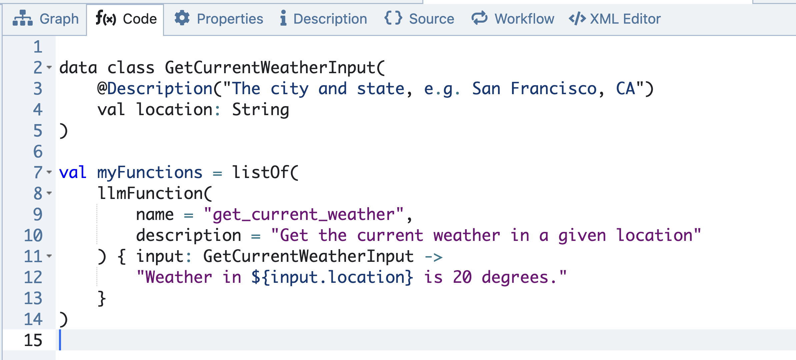

# Using Functions in Generated Speech Nodes

This feature allows Large Language Models (LLMs), such as GPTs, to use user-defined functions. In broader terms, it provides the capability for GPTs to utilize a set of tools to solve the problem at hand. This is particularly useful when you need the LLM to carry out specific, well-defined tasks within your application.

One key area where this functionality is leveraged is within the [Generated Speech Node](generated-speech-node.md). However, using functions in this context can be a bit tricky and requires some basic knowledge of Kotlin programming. Below you will find a detailed example and an explanation of how to implement and use these functions.

### Example Code

<figure><figcaption><p>Function declaration in the Code</p></figcaption></figure>

To apply user-defined functions to a generated speech node, simply use the function.

<figure><figcaption><p>LLM Functions tab in the Generated Speech Node</p></figcaption></figure>

Here's a code snippet.

```kotlin
data class GetCurrentWeatherInput(
    @Description("The city and state, e.g. San Francisco, CA")
    val location: String
)

val myFunctions = listOf(
    llmFunction(
        name = "get_current_weather",
        description = "Get the current weather in a given location"
    ) { input: GetCurrentWeatherInput ->
        "Weather in ${input.location} is 20 degrees."
    },
)
```

Let's break down the example code step-by-step:

#### Data Class Definition

```kotlin
data class GetCurrentWeatherInput(
    @Description("The city and state, e.g. San Francisco, CA")
    val location: String
)
```

This represents input for one function.

#### Explanation:

* `data class GetCurrentWeatherInput`: This defines a Kotlin data class named `GetCurrentWeatherInput`. You can name it anything you like, for consistency, we suffix with `Input`.
* `@Description("The city and state, e.g. San Francisco, CA")`: This annotation provides a description for the `location` parameter. It helps document the purpose of the field and what kind of data it expects.
* `val location: String`: This defines a single property, `location`, of type `String`. It signifies the city and state for which the weather is to be fetched. These data types are also supported, such as `String,` numbers (`Integer, Float, Double`) and `Boolean`.

#### List of Functions

```kotlin
val myFunctions = listOf(
    llmFunction(
        name = "get_current_weather",
        description = "Get the current weather in a given location"
    ) { input: GetCurrentWeatherInput ->
        "Weather in ${input.location} is 20 degrees."
    }
)
```

#### Explanation:

* `val myFunctions`: Declares a variable `myFunctions` which contains a list of functions.
* `listOf(...)`: Creates a list with the specified elements—in this case, a single function created by the `llmFunction` method. You can add as many functions as needed.
* `llmFunction(...) { ... }`: Defines a function that the LLM can call. It specifies a unique name and description for the function and provides its implementation.

#### Inside the `llmFunction` call:

* `name = "get_current_weather"`: Assigns the name `get_current_weather` to the function. This is the name used to invoke the function via the LLM.
* `description = "Get the current weather in a given location"`: Provides a description that explains the purpose of the function.
* Function Body: Defined inside the curly braces `{...}`, it is a [lambda expression](https://kotlinlang.org/docs/lambdas.html#lambda-expressions-and-anonymous-functions) that has input and output types. In this example, the input type is `GetCurrentWeatherInput` and the output is a simple `String`.


