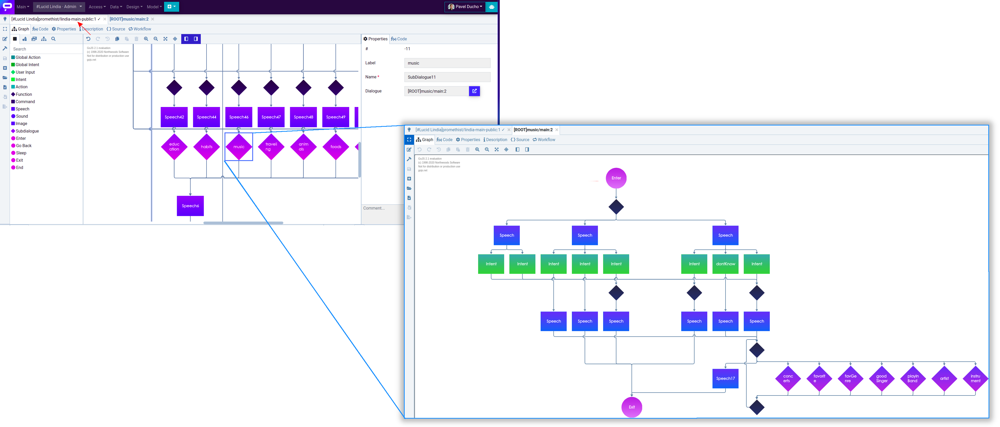
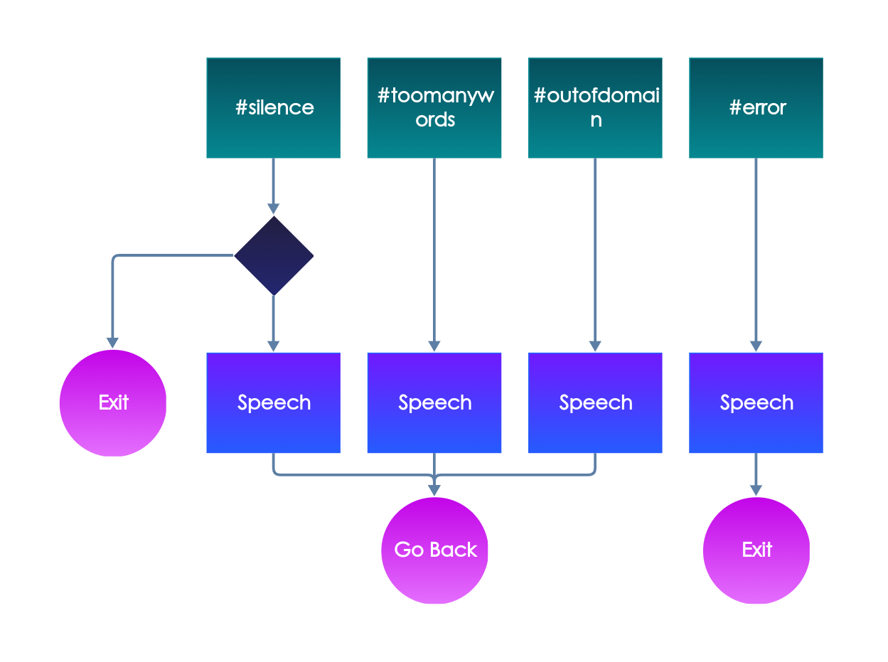

# Node Types

All the node types are the following

## Entering & Leaving the Conversation

The principle is simple - when you want to talk you must **enter** and **exit** each conversation. 

### Entering the Conversation

In our conversational platform entering the conversation is always through the **Enter** node. 

### Leaving the conversation - Exit, End, Sleep

In a specific part of the conversation you might want to allow user to come back and continue. Use **Sleep node** in such situation. The conversation will be sleeping/waiting for an hour by default or you can specify how many minutes you want to left the conversation in sleep mode before the final termination.

Use the end node for the final end of the conversation. 

When the application contains just one \(main\) dialogue then you can't recognize the difference between the exit and end nodes. But when using the subdialogues the situation becomes complex.

### End the Conversation

The End node terminates the **session** and that means the **conversation** with the user at any point.

### Exit the Dialogue Model

Exiting the dialogue model means that the model represented by the graph and its logic behind is terminated but when the dialogue is used as a subdialogue in other dialogue than the conversation \(session\) continues. To be more clear let's have a look at the example.

Let's have an application linked to the _**main dialogue**_ including _several **dialogues used as subdialogues**_ representing the specific topics. Each could be used independently. When it ends then the conversation is over. But when used as a sub-dialogue we can have two situations

* user talking to the application wants to end the whole conversation
* user went through the whole subdialogue and we want to allow him to jump back to the main dialogue

The following example shows how the main dialogue for Lucid Lindia references the dialogue related to the music \(and many more topics\). After the discussion about music and reaching the exit node the conversation continues in the main dialogue.

## Subdialogue

The independent dialogue model but used in the bigger application typically referenced in the main dialogue linked to the application. 

Hierarchy

Subdialogue can include another subdialogue.

## Speech 

The most used node type. What you type in the application will say aloud.

The text in the node will be sent to the Text To Speech converting the text to voice. A node can be set as repeatable. If true, the text in this node will be included when the bots repeat a response. The typical situation is when the intent is not recognized and the application repeats the question asking for the input again.

## Intent

**Intent nodes** serve to represent the user’s **utterances**. These are similar to the intent node but they do not start a branch, they continue one. Usually, several nodes are connected to an input node. Several Contextual Intent nodes are provided with pre-filled common utterances. These nodes have a “Negate“ function \(available above the text editor\). It creates a new node with utterances which are negations of the original node utterances \(e.g. from node with utterance “I like that“ will be created a node containing an utterance “I don’t like that“\).

**NOTE**: The new nodes are created on top of the originals.

### Global Intent 

This node serves for starting a branch of a dialogue. One node labeled ‘Start’ is required for each dialogue, others are optional. In the headline, fill in the intent’s name \(must be unique in context of the current dialogue\). The content of this node are examples of user utterances which represent this intent \(e.g. fill in “What time it is“ or “Do you know the time“ for intent which prompts the bot to tell its user the time\). The exception is the start node which is empty.

### Action \(local\) 

We get the input into the model but not said by the user. The most typical action is **silence**. There is no intent because a muted microphone or a user really stayed silent. See the global actions below for more examples.

### Global Action 

This node serves for starting a branch of a dialogue. 

What actions to cover on the global level?

* silence
* outofdomain
* error
* toomanywords


Save your time and use the prepared [snippet](snippets.md) _Global actions required_.


### Go Back 

A Go Back node follows typically after the \(global\) action + speech. See the [example for the global actions](node-types.md#global-action).

### Sound 

Sound node is a special version of the Response node. The designer can write either an audio item from File Assets or a full URL pointing to audio resource file.

NOTE: Option “External” must be chosen in the dropdown menu above the text editor for the latter to work.

### Function 

In case the dialogue needs to be directed programmatically, use this node. One link can go in and multiple out. Headline is the name of the function and should be unique.

The JS function should return the number of the next node. When the dialogue is loaded, the functions is included in the code on the “Functions“ tab.

### User Input 

This node can also be filled with code similarly to Function node.

| **Property name** | **Property type** | **Purpose** |
| :--- | :--- | :--- |
| Disable global intents | boolean | If true, global intents will be disregarded when deciding the next state |

### Image & Sound 

Drag & drop an image or a sound from pane into your graph. 

1. Upload files to your Space
2. Open the multimedia tab \(assets\) in the dialogue designer
3. Insert a file into a dialogue \(drag&drop\)

For the step-by-step guide got to [Add Sounds and Images](../../../how-to/design/multimedia.md).

### Command 

Use a command node when you want to invoke a special action on the client \(device\). The example can be that a robot will _say_ what comes in as _speech_ and raise a hand when receiving a specific _command_.

###  

