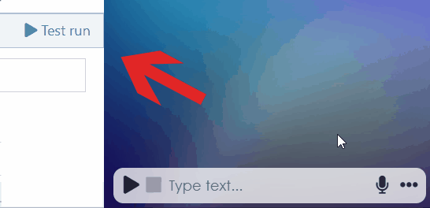

# Quick start guide

## Open Flowstorm

Open [app.flowstorm.ai](https://app.flowstorm.ai/). We recommend you to sign up but anonymous users can also use the platform (with limited features).

How to sign up

1. Open [app.flowstorm.ai](https://app.flowstorm.ai/)
2. Click on **Sign Up** in the top right corner to open a sign-up form.
3. Choose a preferred authentication provider (Google, Apple, Slack) or create an account using just your e-mail and a password.
4. (If you have used your e-mail and password, check your e-mail inbox and click on the confirmation link to approve that you are the owner of the address. After confirming the e-mail, Flowstorm will create your _Space_.)
5. From now on, you can easily [log in](https://promethist.app/#!/login) anytime.

Now you can invite your collaborators or start designing your first dialogue and voice application.

## How to start prototyping

### Your first simple dialogue

You are in the Dialogue Designer now and you should see the following structure.

It is the default structure of your new dialogue. It already covers all the necessary basic features, and it is fully functional. As you can see, it is a structure of **nodes** with different colors, interconnected by little arrows that we call **transitions**.

There is no need to dive into all types of nodes at this point. For now, you just need to know that the light-green nodes, called **Intents**, represent categories of user messages, and the blue nodes, called **Speeches**, represent what the digital persona says.

Let's focus on the lower right quadrant of the graph. Try clicking on the green intents, then on the blue speeches. In the right panel, you will see the node content. Now it's time to start customizing the content.&#x20;

_NOTE: If you cannot make changes to the content, the editing mode might not be activated. In that case, activate it by clicking on this button:_

Now try to think of 3 pairs of questions and answers that you want to teach the digital persona.

In the green intents, write different formulations of the question, so that the persona can better understand the meaning of the intent. Each new line is a new variant.

In the blue speeches, type what the persona should reply. You can again write different formulations – in this case, the persona will select one of them.

Once you fill in all the nodes, just click the **Test run** button.

The model will be built in a few seconds, and you can try right away your first Flowstorm voice dialogue!

## Watch our video tutorial


Please take into account that the following video was published in 2021 and some visual and functional features may have changed since then.




