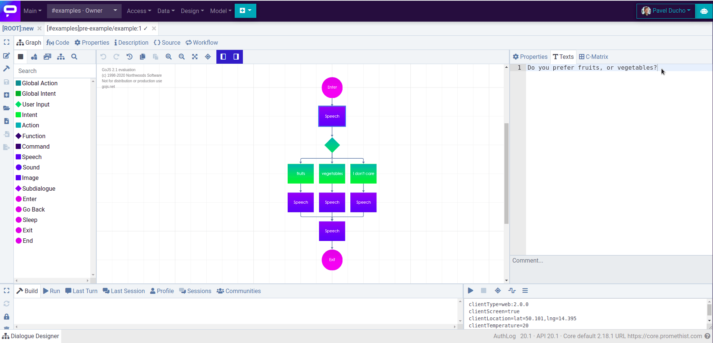

# Quick Start Guide

### How to sign up

You must sign up if you are a new user who wants to try the platform for the first time.

1. Open [https://promethist.app/](https://promethist.app/)
2. Click on “Sign Up” in the top right corner to open a sign-up form.
3. Choose a preferred authentication provider \(Google, Apple, Facebook, Twitter, Slack\) or create an account using just your e-mail and a password.
4. Check your inbox and click the confirmation link to approve that you are the owner of the address.
5. After confirming the e-mail, the Promethist Platform will create your space.
6. From now on, you can easily [log in](https://promethist.app/#!/login) anytime.

Now you can invite collaborators or start designing your first dialogue and voice applications.

### Overview of the Collaboration Process

* Sign-up
* Invite your collaborators to your Space
* Come up with a concept of the application
* Divide the concept into smaller parts \(main dialogue + subdialogues\)
* Create dialogue models, start designing the subparts and testing them
* Test the application as a whole
* Publish and share the application

### Collaboration – Space

The Promethist Platform is ready for collaborative design: developers will share dialogue models in the same “Space”. The creator of the Space must invite the collaborators. In the main menu: Access → User Invitations: it will open a window to send the invitation to the collaborators’ e-mails. 

* Fill in an e-mail address.
* Choose a role for the user.
* Confirm by clicking on the “Create” button
* An invitation will be generated and the invited user will receive a notification.

### How to start prototyping – open the Dialogue Designer

Open the **“Design” section in the top panel** and choose **Dialogue Designer** or just press the key **"d" as a keyboard shortcut**. You can start designing!

### Your first simple dialogue

We will create a simple prototype with the question offering two possible answers. 

Let’s say we want our assistant to ask a question: “Do you prefer fruits or vegetables?“, then wait for the response and react to it.

So let’s start designing. We represent the dialogue as a graph of interconnected nodes. These nodes have different types: you can see the list in the left panel. Our first dialogue will only use the basic node types: Enter, Exit, Speech, UserInput and Intent.

1. First, we must show the assistant where to start – where to **Enter** the graph. Drag the Enter node from the left panel and drop it into the canvas.
2. We know that the assistant should then **ask a question** – to make the assistant speak; we will use the **“Speech”** node. Connect Enter + Speech node to show our assistant the path. Type the question to the right upper panel with the Tab **Texts**.
3. After uttering the question, the assistant starts listening and waits for user input. We will indicate this by connecting the **User Input node**.
4. Now, we will try to **estimate** what will be the **user’s response?** What are the possible so-called **intents**? Users can answer they prefer fruits, vegetables. They can also say other things – but for now, let’s expect three „intents“ – fruits, vegetables, and I don’t care. Each **intent needs some example phrases** – the assistant will deduce the intents’ meaning from these examples.
5. Since we want the **assistant to react** differently to each intent, we can now connect three Speech nodes and write the desired responses.
6. We might also want the **assistant to say goodbye**, no matter what path we took before. So let’s connect one **last Speech node** and write the utterance.
7. And **finally**, we saw that the graph had an entrance, so there should also be an **Exit**.

**Voilà!** Your first dialogue model is ready. Now, the only thing you have to do is build it and run it. Click the **run button** in the bottom right panel and see if everything works correctly.

  

Promethist will save the dialogue, build it, and run it. You will have to name the dialogue. The convention is namespace/dialogue-name. 

### Create an Advanced Dialogue Quickly

### Use Snippets

The Promethist Platform comes with a set of sample dialogue structures called **Snippets**. Click on the icon suggesting a _**branched structure**_, and you will find the Snippets list. You can see the typical structure for the closed question and its typical answers in the animation above. You will need something like often.

However, we recommend looking at the Main dialogue EN snippet. Drag and drop it to the canvas, and you can immediately run it. It demonstrates the essential elements making the dialogue **robust**. The **Main dialogue EN** snippet handles the following situations gracefully:

* The user wants to stop,
* The user asks for help.
* The user wants to repeat the message.
* The user is not responding.
* Etc.

Note global intents execute these situations. We placed the Global intents in the upper left corner of the snippet graph.

For details on how to use the snippet designer, see the documentation page.

### Subdialogues

The platform allows breaking every dialog to sub-dialogues. Sub-dialogues help structure the whole application and allow multiple developers to cooperate on the same project. Think about a sub-dialog as a function in a programming language. You can call the sub-dialogs, and they return after completion. 

#### When to use this feature?

* You need to collaborate with others in parallel. Each team member can work on a particular feature \(sub-dialog\).
* Structure the dialog better. Divide a complex app into separated sub-dialogues.
* You can add and use a specific feature \(dialogue\) in several main dialogues.

### Testing

Just explaining how to start the created dialog and how to observe in the window the dialog progress

### Sharing - Sending a link

We have a finished dialog, and we want a tester to try it. We need to create the application URL to send it over. The publication workflow goes like this: 

* Create an application - In the top panel &gt; **Access &gt; Applications** &gt; Click the **plus button** **\(+\)** located in the **top right corner**

* Name & Description - name and describe your application
* Link the main dialogue to the application
* Make the application anonymously accessible
* Save
* Test the Web Bot URL - click the “open in the new window” Arrow icon
* Copy and share the link to the world

Open Access section &gt; Applications

Choose and test the existing application or 

* Create a new application
* Specify the main dialogue

Check the “Allow anonymous access,” save the new properties, and now you can run the application here and finally **share the web bot URL** to the audience.  

