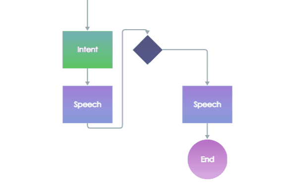
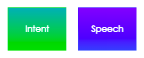
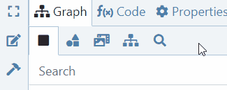
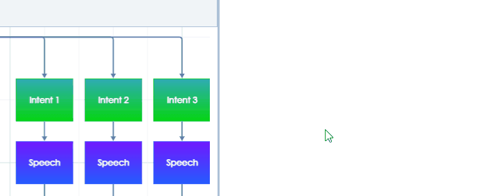

# Quick Start Guide

## How to sign up

You must sign up if you are a new user who wants to try the platform for the first time.

1. Open [app.flowstorm.ai](https://app.flowstorm.ai/)
2. Click on **Sign Up** in the top right corner to open a sign-up form.
3. Choose a preferred authentication provider \(Google, Apple, Facebook, Twitter, Slack\) or create an account using just your e-mail and a password.
4. Check your inbox and click on the confirmation link to approve that you are the owner of the address.
5. After confirming the e-mail, Flowstorm will create your _Space_.
6. From now on, you can easily [log in](https://promethist.app/#!/login) anytime.

Now you can invite your collaborators or start designing your first dialogue and voice applications.

## How to start prototyping

### Your first simple dialogue

You are in the Dialogue Designer now and you should see the following structure.

It is the default structure of your new application. It already covers all the necessary basic features, and it is fully functional. As you can see, it is a structure of nodes with different colors, interconnected by little arrows that we call transitions.

There is no need to dive into all types of nodes at this point. For now, you just need to know that the light-green nodes, called intents, represent categories of user messages, and the blue nodes, called speeches, represent what the digital persona says.

Let's focus on the lower right quadrant of the graph. Try clicking on the green intents, then on the blue speeches. In the right panel, you can see the node content. Now it's time to start customizing the content. For that, you must first activate the edit mode by clicking on this button.

Now try to think of 3 pairs of questions and answers that you want to teach the digital persona.

In the green intents, write different formulations of the question, so that the persona can better understand the meaning of the intent. Each new line is a new variant.

In the blue speeches, type what the persona should respond. You can again write different formulations, the persona will select one of them.

Once you fill all the nodes, just click the **Test run** button. The model of your app will be built in a few seconds, and you can try right away your first Flowstorm voice app!

