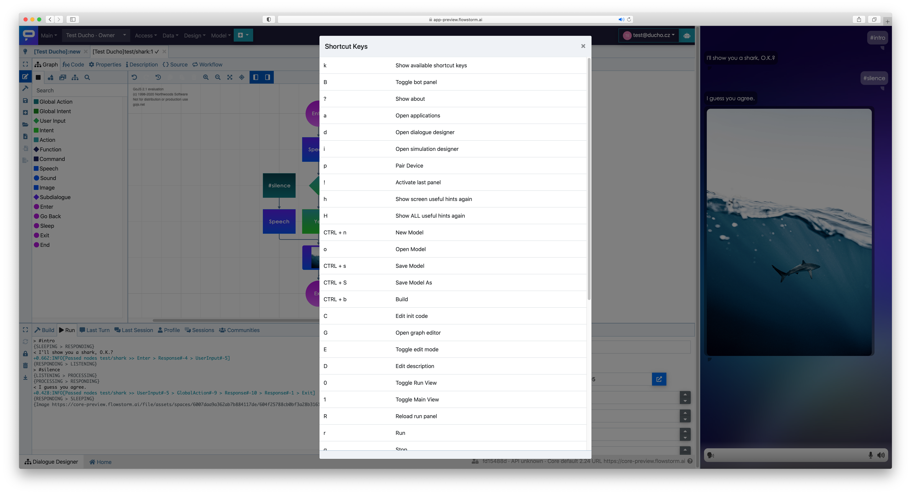

# Keyboard Shortcuts


Press "k" to view the list of shortcuts relevant to the current page.


### Useful Shortcuts for Designers

| d                | Open dialogue designer                    |
| ---------------- | ----------------------------------------- |
| !                | Activate last panel                       |
| h                | Show screen useful hints again            |
| H                | Show ALL useful hints again               |
| o                | Open dialogue model                       |
| Shift + E        | Start/end edit mode                       |
| CTRL + s         | Open dialogue model                       |
| CTRL + Shift + S | Open dialogue model **As new**            |
| CTRL + b         | Build dialogue model                      |
| r                | Run dialogue model                        |
| a                | Open applications                         |
| 1                | Toggle main area - hide additional panels |
| 2                | Toggle left panel                         |
| 3                | Toggle right panel                        |
| +                | Zoom in                                   |
| -                | Zoom out                                  |
| .                | Fit to viewport                           |
