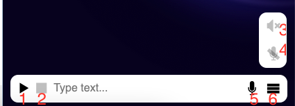

# \*Interactive side-panel


The 'ASSISTANT' sub-panel was originally designed to help users navigate the platform, but this feature has since been discontinued and is no longer supported. **This article focuses only on the 'BOT' sub-panel.**


### Bot controls

The controls are mostly the same for the testing bot and the assistant, but they are enabled for the testing bot only if the user is on a page with a dialogue or an app to run.



1. **Play/pause button** - you can start a dialogue with it, pause a bot utterance or resume it.
2. **Stop button** - use it to prematurely end the conversation.
3. **Output audio** - switches output audio on and off. If it is off, neither bot responses nor status SFX will be played. Dark icon means the audio is off.
4. **Input audio** - switches input audio on and off. If it is off, the bot will not listen to user's voice, only text. Dark icon means the audio is off.
5. **Multi-purpose control button**
   1. When there is a text typed in, use this button to send it (can be also done with Enter). The icon will change to arrow.
   2. When the bot is speaking, press the button to skip its utterance and go to listening state
   3. (Assistant only) Start the dialogue by listening to user's audio input. This function is disabled if input audio is turned off.
6. **Controls menu button** - displays or hides buttons 3 and 4&#x20;

### Assistant developers

The bot sends the page which the user has currently open in its first request as an attribute. &#x20;


```
var page by client { "" }
```

The attribute always contains the path same as it is in the URL. You can access only the last part with the function

```
page.substringAfterLast("/")
```

